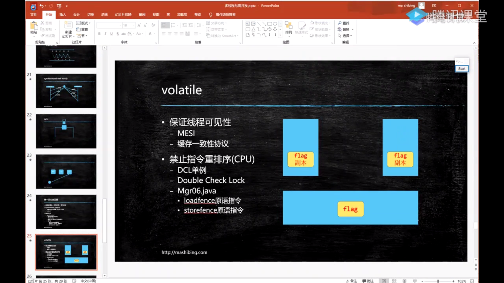

## 多线程


### base concept
进程（Process）是计算机中的程序关于某数据集合上的一次运行活动，是系统进行资源分配和调度的基本单位，是操作系统结构的基础。    
线程:操作系统能操作进行运算调度的最小单位.它被包含子进程中,是进程中的实际运作单位.    
一条线程指的是进程中一个单一顺序的控制流，一个进程中可以并发多个线程，每条线程并行执行不同的任务。

- 分类

用户级线程: 管理过程全部由用户程序完成，操作系统内核心只对进程进行管理。    
系统级线程（核心级线程）: 由操作系统内核进行管理。操作系统内核给应用程序提供相应的系统调用和应用程序接口API，以使用户程序可以创建、执行、撤消线程。    
在Unix System V及SunOS中也被称为轻量进程（lightweight processes），但轻量进程更多指内核线程（kernel thread），而把用户线程（user thread）称为线程。    

- 进程与线程的关系:

同一进程中的多条线程将共享该进程中的全部系统资源，如虚拟地址空间，文件描述符和信号处理等等。    
但同一进程中的多个线程有各自的调用栈（call stack）,寄存器环境（register context）,本地存储（thread-local storage）。
通常都是把进程作为分配资源的基本单位，而把线程作为独立运行和独立调度的基本单位。

具体区别:    
```
1）地址空间和其它资源（如打开文件）：进程间相互独立，同一进程的各线程间共享。某进程内的线程在其它进程不可见。
2）通信：进程间通信IPC，线程间可以直接读写进程数据段（如全局变量）来进行通信——需要进程同步和互斥手段的辅助，以保证数据的一致性。
3）调度和切换：线程上下文切换比进程上下文切换要快得多。
4）在多线程OS中，进程不是一个可执行的实体。
```

- 使用场景

1 服务器中的文件管理或通信控制
2 前后台处理
3 异步处理

- 特点:

轻型实体.基本不拥有系统资源,只需要一些必需的独立运行资源.包括程序,数据,TCB线程控制块TCB（Thread Control Block）    
独立调度和分派的基本单位    
可并发执行.    
共享进程资源.所有线程都具有相同的地址空间（进程的地址空间）;可以访问进程所拥有的已打开文件、定时器、信号量机构等;    


- 启动线程的三种方式    

Thread,Runnable, ExcutorThreadPool线程池

- 常用方法:

yield,join,sleep

join.阻塞主线程,知道当前线程执行结束.在很多情况下，主线程生成并起动了子线程，如果子线程里要进行大量的耗时的运算，主线程往往将于子线程之前结束，但是如果主线程处理完其他的事务后，需要用到子线程的处理结果，也就是主线程需要等待子线程执行完成之后再结束，这个时候就要用到join()方法了。

不建议用 stop

interrupt用于程序底层退出,同时通知其他线程终止运行,业务实现中一般用不到.


### 同步

线程由于共享进程的数据段,这样对于竞争资源,就存在数据一致性问题.    
线程在程序中是独立的、并发的执行路径，每个线程有它自己的堆栈、自己的程序计数器和自己的局部变量。但是，与分隔的进程相比，进程中的线程之间的隔离程度要小。它们共享内存、文件句柄和其它每个进程应有的状态。    
进程可以支持多个线程，它们看似同时执行，但互相之间并不同步。一个进程中的多个线程共享相同的内存地址空间，这就意味着它们可以访问相同的变量和对象，而且它们从同一堆中分配对象。尽管这让线程之间共享信息变得更容易，但您必须小心，确保它们不会妨碍同一进程里的其它线程。

线程属性:线程的外在特征:线程体(run()),线程状态(生命周期阶段)

    


- 常用方法

sleep() 将当前运行态线程进行阻塞状态(暂停执行,释放cpu资源,但是不释放锁),睡眠状态被中断,会抛出IterruptedException中断异常.线程到期会自动苏醒,进入可运行状态,进行cpu执行时间竞争;    
wait,notify,notifyAll:当前线程不含有当前对象的锁资源的时候(没有获取到锁时),会报java.lang.IllegalMonitorStateException异常

由于多线程存在共享变量竞争导致数据一致性问题,它可以通过同步来解决.

Java Object Model:    


数据一致性问题:

	原子性
	可见性
	执行顺序

共享资源数据一致性问题:
	
synchronized既可以保证可见性也能保证原子性,但是无法解决指令重排序的问题;
volatile:可见性和禁止指令重排序;但是无法保证原子性

- synchronized(Object)

详细解释: [synchronized](synchronized.md)

```
锁的是对象不是代码    
this T.class(static)    
锁定方法和非锁定方法可同时执行    
锁升级(偏向锁,自旋锁,重量级锁)    
```

锁是任意object对象    
锁不建议使用基础数据类型和String.因为基础数据类型和string都会创建缓存池,容易造成潜在的锁共用,引起死锁问题.

synchronized method = synchronized(this)
synchronized static method = synchronized(T.class)

静态方法是单例吗?一般是,但是不同的**类加载器**可以生成不同的静态方法,静态类.


类加载顺序

同步方法调用时是否允许调用非同步方法?
脏读的典型场景,写加锁,读不加锁,这时就可能读取到中间状态,这个并不一定是问题,需要看自己的业务场景是否允许.

可重入:

	同一把锁是否允许当前线程访问拥有同一把锁的其他方法,如果运行则是可重入,不允许则不可重入.
	可重入对于Java很重要,比较典型的场景是子类访问父类方法,如果不可重入,则会出现同一把锁无法调用父类方法的问题.
	
	


### 锁升级:	

偏向锁    
自旋锁 线程数少    
重量级锁 线程数多,线程操作时间长    

自旋锁:

CAS自旋锁


详细解释: [cas](cas.md)


- 指令重排序((读写屏障))

指令重排序:是指编译器或CPU为了优化程序的执行性能而对指令进行重新排序的一种手段，重排序会带来可见性问题，所以在多线程开发中必须要关注并规避重排序。

从源代码到最终运行的指令，会经过如下两个阶段的重排序。

第一阶段，编译器重排序，就是在编译过程中，编译器根据上下文分析对指令进行重排序，目的是减少CPU和内存的交互，重排序之后尽可能保证CPU从寄存器或缓存行中读取数据。避免了处理器每次都去内存中加载stop，减少了处理器和内存的交互开销.    
第二阶段，处理器重排序，处理器重排序分为两个部分

	并行指令集重排序，这是处理器优化的一种，处理器可以改变指令的执行顺序。    
	内存系统重排序，这是处理器引入Store Buffer缓冲区延时写入产生的指令执行顺序不一致的问题，在后续内容中会详细说明。


- 并行指令集

在处理器内核中一般会有多个执行单元，比如算术逻辑单元、位移单元等。在引入并行指令集之前，CPU在每个时钟周期内只能执行单条指令，也就是说只有一个执行单元在工作，其他执行单元处于空闲状态；在引入并行指令集之后，CPU在一个时钟周期内可以同时分配多条指令在不同的执行单元中执行。


对于一条从内存中读取数据的指令，CPU的某个执行单元在执行这条指令并等到返回结果之前，按照CPU的执行速度来说它足够处理几百条其他指令，而CPU为了提高执行效率，会根据单元电路的空闲状态和指令能否提前执行的情况进行分析，把那些指令地址顺序靠后的指令提前到读取内存指令之前完成。

实际上，这种优化的本质是通过提前执行其他可执行指令来填补CPU的时间空隙，然后在结束时重新排序运算结果，从而实现指令顺序执行的运行结果。

- as-if-serial语义

as-if-serial表示所有的程序指令都可以因为优化而被重排序，但是在优化的过程中必须要保证是在单线程环境下，重排序之后的运行结果和程序代码本身预期的执行结果一致，Java编译器、CPU指令重排序都需要保证在单线程环境下的as-if-serial语义是正确的。在多线程中，重排序会带来可见性问题。

另外，为了保证as-if-serial语义是正确的，编译器和处理器不会对存在依赖关系的操作进行指令重排序，因为这样会影响程序的执行结果。我们来看下面这段代码。

```
public void execute(){
    int x=10;  //1
    int y=5;   //2
    int c=x+y; //3
}
```

上述代码按照正常的执行顺序应该是1、2、3，在多线程环境下，可能会出现2、1、3这样的执行顺序，但是一定不会出现3、2、1这样的顺序，因为3与1和2存在数据依赖关系，一旦重排序，就无法保证as-if-serial语义是正确的。但是在CPU层面还存在内存系统重排序问题，内存系统重排序也会导致可见性问题。

- volatile


可以解决可见性和指令重排序(顺序性)

实现原理:内存屏障

volatile无法替代synchronized,因为它无法解决原子性问题.如: count++;

volatile无法保证原子性     


单例与volatile

单例懒汉式:双重检查


new对象过程(内存分配流程):
	1 分配内存
	2 初始化(设置默认值)
	3 复制

但是指令重排序可能发生在new的流程中,造成线程不安全

ASM进行编译二进制可执行文件

### 锁优化:

去除锁:cas    
锁细化 只加载需要进行一致性处理的业务逻辑上    
锁粗化 同一个方法中有多个锁处理,可以通过锁合并来优化


- CAS

cas原理,其实就是乐观锁.乐观的认为,我修改时,才需要进行加锁	

m=0;
m++;
expected = read m;
cas(expected,actual) {
	for(;;) {
		if(actual==expectd) m = actual
	}
}

ABA问题:AtomicStampedReference
基础数据类型没有问题;引用类型,可能存在间接引用对象的修改问题.

obj -> A -> ref C
	-> B -> ref D
	-> A -> ref D

	这时比较线程再获取obj的引用对象还是A,但是实际的间接引用已经被修改了

- Atomic*的实现  

基于CAS进行修改数据的对比,如果和期望值相同则进行修改,否则获取新值后继续比较;它实际是基于Unsafe类保证数据操作的原子性实现.

AtomicInteger


实现原理:

它依赖Unsafe的方法getAndAddLong,这个方法通过CAS实现原子自增操作
```
/**
 * Atomically increments by one the current value.
 *
 * @return the updated value
 */
public final long incrementAndGet() {
    return unsafe.getAndAddLong(this, valueOffset, 1L) + 1L;
}
```


Unsafe    


### 锁细化-分段锁

分段锁:通过细化锁的范围来实现锁优化的手段.    


hashtable,hashmap,concurrenthashmap:    
[hashtable,hashmap,concurrenthashmap](hashtable,hashmap,concurrenthashmap.md)


- increment compare

实现多线程安全自增的方式有下面三种:    
```
synchronized
AtomicLong 不加锁
LongAdder
```

LongAdder 原理


采用了cas+分段锁的机制来优化单纯cas在竞争激烈时的大量自旋问题.

[LongAdder 原理](https://www.jianshu.com/p/b3c5b05055de)

分段锁进行求和处理.

- 为啥LongAdder比AtomicLong好?

AtomicLong的缺点:    
1 AtomicLong因为通过CAS来实现原子自增,这种方式适合线程竞争不激烈的场景;而竞争激烈会造成大量的线程自旋,并进行值修改重试,但是这个值只有一个线程可以修改成功,会造成频繁的自旋.浪费了大量的CPU资源;    
2 value是volatile修饰的共享变量,它被所有线程共享,所以值使用时也有注意共享变量的影响effort;    
线程共享变量:     


LongAdder:    
原理:cas+分段锁.也使用了volatile修改base值,但是竞争激烈时,多线程不再自旋进行该值修改,每个线程将分段并将计算值维护到Cell[]数组中,而不是共享一个值.最终求和通过cell数组中的数据求和,得到最终的结果.通过空间换取时间.

所以LongAdder和AtomicLong选择的依据是竞争的激烈程度;并非谁绝对好

LongAdder vs AtomicLong: 
[LongAdder vs AtomicLong](https://programming.vip/docs/which-of-longadder-and-atomiclong-performs-better-and-why.html)

synchronized优点:
内存开销小;    
jvm进行内部优化:JVM能够在运行时作出相应的优化措施：锁粗化、锁消除、锁自旋等

### JUC的同步锁

- ReentrantLock
- CountDownLatch
- CyclicBarrier
- Phaser
- ReadWriteLock- StampedLock
- Semaphore
- Exchanger
- LockSupport


### ReentrantLock

ReentrantLock 用于替换synchronized;支持可重入锁;公平锁;且锁需要自己定义和释放;而synchronized由jvm自动释放;

- 可重入锁: 任意线程在获取到锁之后能够再次获取该锁而不会被锁所阻塞。

可重入锁的原理： 通过组合自定义同步器来实现锁的获取与释放。    
再次获取锁：识别获取锁的线程是否为当前占据锁的线程，如果是，则再次成功获取。获取锁后，进行计数自增，    
释放锁：释放锁时，进行计数自减。    
Java中的可重入锁： ReentrantLock、synchronized修饰的方法或代码段。    
可重入锁的作用： 避免死锁。

- tryLock进行锁判定,避免阻塞;

- lockInterruptibly()用于替换lock(),锁定中可以被打断;

- 公平锁: 锁竞争时,先判断等待队列中是否有线程,有的话则进入等待队列,否则则直接进行竞争;ReentrantLock(true)

- 使用

1 需要显示的定义加锁:ReentrantLock.lock(),解锁:ReentrantLock.unlock()操作


2 读写锁: ReentrantReadWriteLock.readLock();ReentrantReadWriteLock.writeLock();

可通过方法来具体细分读锁和写锁,实现上更灵活;


#### synchronized与reentrantlock的区别???

1 管理方式不同
2 reentrantlock可以定义不同的condition(等待队列)
3 实现方式不同.synchronized是内存屏障;reentrantlock是cas


### 线程执行控制

执行流程控制.可以使用 countDownLatch ,join来控制
计数阻塞,latch.await();
join是将执行线程统一管理,灵活性没有countDownLatch好

CyclicBarrier:线程执行数量控制;通过阻塞线程执行,来实现批量线程业务操作

 

demo


Phaser

Semaphore:信号量,类似于令牌,通过它可以实现线程方法的原子性访问;

限流
demo:


Exchanger

信息交换,阻塞进行 场景???

demo     


- LockSupport

用于阻塞或放行阻塞当前线程.
LockSupport.park(); // 阻塞
LockSupport.unpark(); // 放行


### 问题


- 静态与线程安全的关系.静态是否可以使线程安全??

static:不能保证线程安全.因为线程会生成变量的副本,所以线程内的修改不能保证所有线程间可见,也就存在数据不一致,即线程安全问题.

volatile: 确保了变量在线程间的可见性.它确保线程不进行变量数据缓存,只是用共享副本.

static:的全局唯一指的是创建实例只能有一个,但是线程对于变量的使用,可以有自己的本地缓存数据.

[volatile vs static](https://stackoverflow.com/questions/2423622/volatile-vs-static-in-java)

### 推荐资料:

<实战高并发程序设计>


