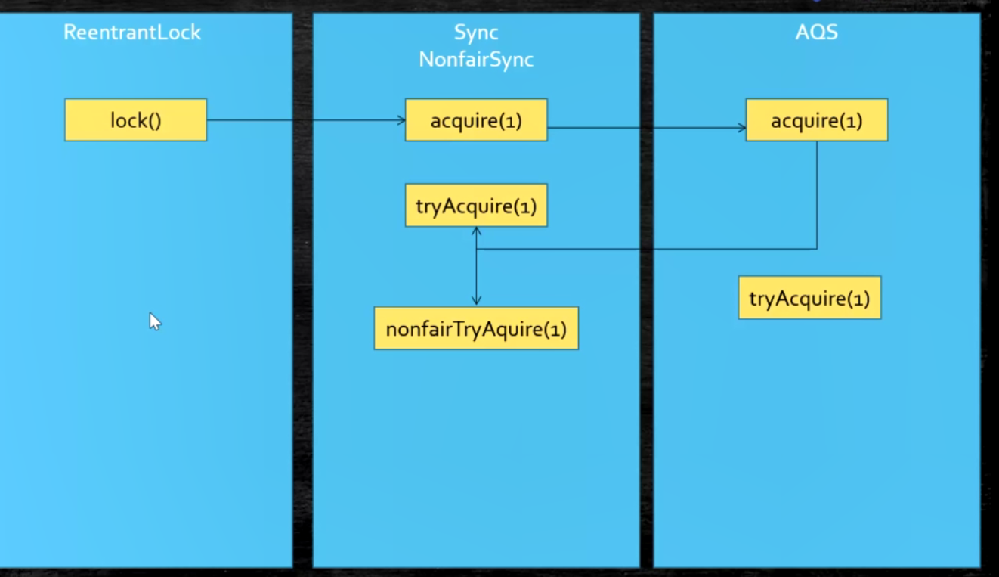
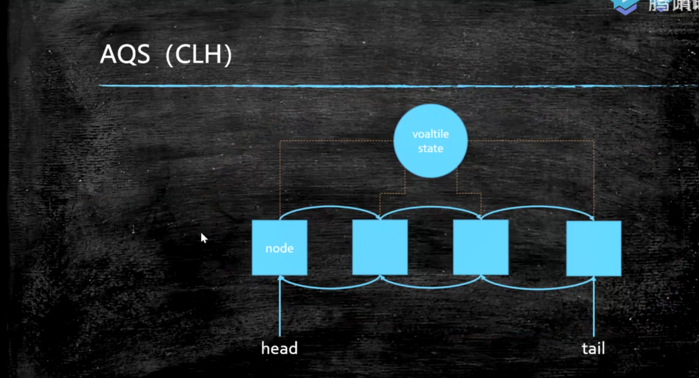

## multi thread2

### 源码阅读

核心是理解别人的思路:    
1. 数据结构基础    
2. 设计模式    

原则:    
1. 跑不起来不读(debug跟踪,便于调用链识别及参数识别)
2. 解决问题就好-目的性
3. 一条线索到底(约束阅读范围)
4. 无关细节略过(约束阅读范围)
5. 一般不读静态(去除非必要内容)
6. 一般动态读法
7. 先读骨架

读骨架是识别类调用图,一般使用uml来记录和记忆:

### aqs 

原理:CAS + volatile

state是volatile修饰的,并且设置state的方法处理有
有setState,还有compareAndSetState

入队,出队 cas

- VarHandle
- ThreadLocal 线程独有    

    set方法,通过Thread.currentThread.map(ThreadLocal,obj)将值放到线程内部独享    
    声明式事务:通过aop进行事务的提前声明,避免业务代码侵入性.而事务的实现通过ThreadLocal获取线程独有变量信息    
    编程式事务:自己控制事务的开始,提交,回滚.优点:事务粒度灵活;缺点:代码侵入性高,开发和维护都不方便.

WeakReference 只要垃圾回收,就会直接被回收;作用当强引用指向的引用消失后,弱引用就应该也消失;一般用在容器里???

PhantomReference 虚引用,jvm

作业
AQS addWork源码
WeakHashMap 作用

